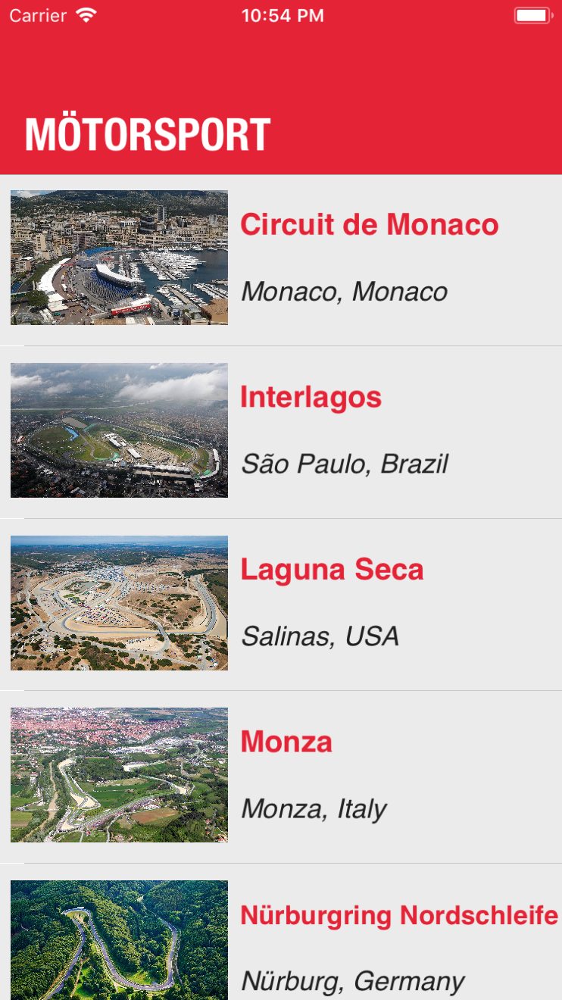
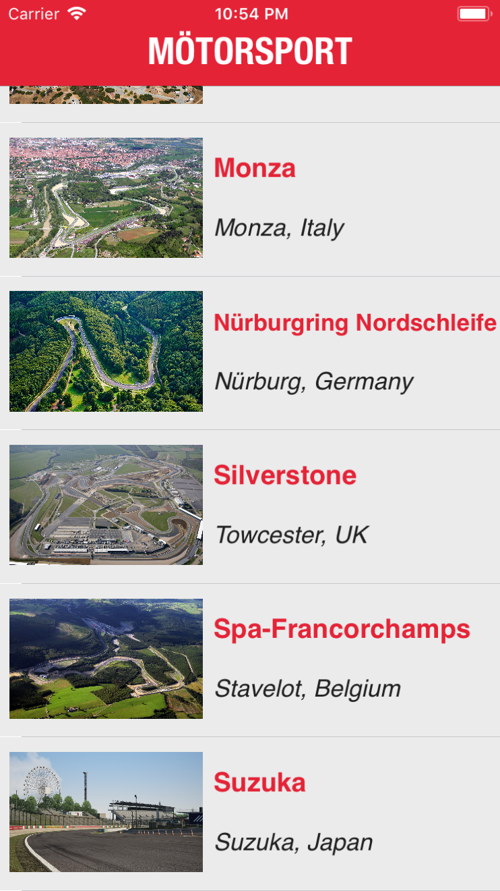
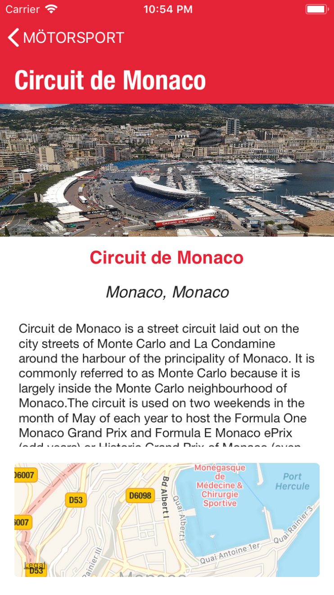

# Mötorsport
An iOS app for motorsport enthusiasts. The app displays information regarding race tracks around the world.

<b> What Did I Learn? </b>
<ul> 
<li> Setting up a Table View Controller </li>
<li> Populating cells within a TableView </li>
<li> Navigating between a TableView and a Detail View Controller </li>
<li> AutoLayout and setting up constraints </li>
<li> How to incorporate MapKit within my application </li>

# Screenshots
<table>
<tr>
<td>  </td>
<td>  </td>
<td>  </td>
</tr>
</table
